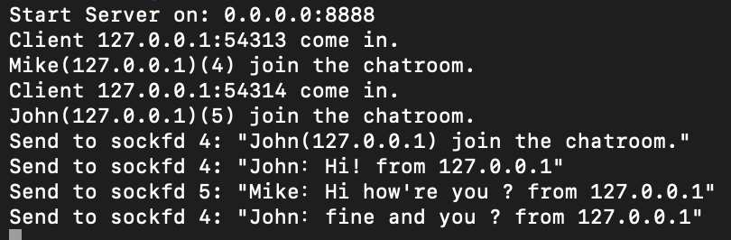
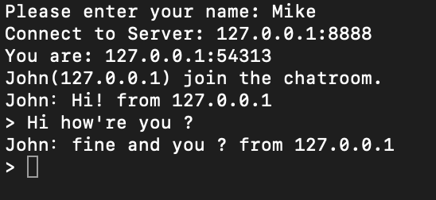
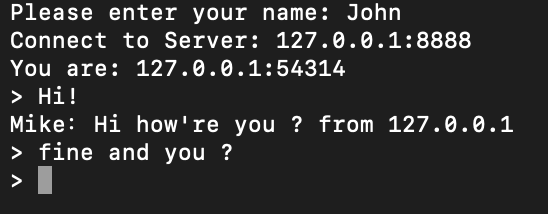

# C_messenger

## Description

The goal of this project is to make a chatting application in C.
Thanks to the threads the program can take care of several discussions.

## How to use

1. Makefile compilation:

  ```sh
    make
  ```
  ```sh
    make re
  ```
  ```sh
    make clean
  ```
  ```sh
    make fclean
  ```
       
2. execute serveur:

  ```sh
    ./server
  ```
 
3. execute client(s):

  ```sh
    ./client
  ```
  
## Server



## Client 1



## Client 2


